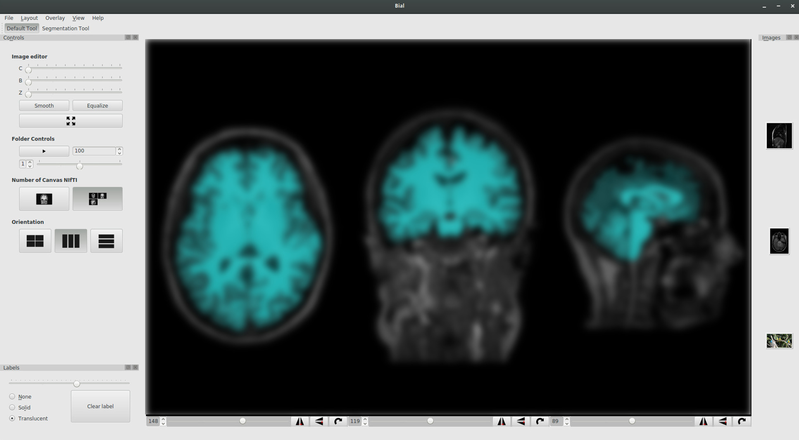

# Biomedical Image Analysis Library


The **Biomedical Image Analysis Library** is a poweful tool for developers, physicians, researchers, engineers, and so on.
With a intuitive user interface, a physician can make semi-automated diagnostics, segmentations, and apply sophisticated image processing filters using drag and drop features.



Since it is an **Open Source** Library, its tools and functions can be used by developers, researchers and engineers to make their own applications.


## Compiling BIAL

First, you will need Qt ( > 5.5 ), an opensource C++ framework, that can be found in [http://download.qt.io/](http://download.qt.io/).

The easiest way to install the library is opening the file "master.pro" on QtCreator, and selecting the "Build", according to the desired build mode (release or debug). Then, the library will be generated at BIAL/build/&lt;linux/windows>/&lt;release/debug>/lib, and the BIAL GUI will be found at BIAL/build/&lt;linux/windows>/&lt;release/debug>/bialgui.

_Warning:_
    As libbial.so is a shared library, you will need to add its path to LD\_LIBRARY\_PATH (or DYLD_LIBRARY_PATH os MAC OS), with the following command:
    ```bash
        export LD_LIBRARY_PATH=<BIAL_PATH>/build/<linux|windows>/<release|debug>/lib
    ```
**Example:**
    In a machine running ubuntu 16.04, you could download Qt 5.7, and compile the whole library and run a test example with the following commands:
    ```bash
        #Installing Qt 5.7
        sudo apt update
        sudo apt install qt-sdk git

        #Downloading BIAL library from github
        git clone https://github.com/GIBIS-UNIFESP/BIAL

        cd BIAL
        # Generating the makefile with qmake
        qmake -r . 

        # Building the whole project
        make

        # Building a test binary
        cd tst
        make Image-Copy
        export LD_LIBRARY_PATH=../build/linux/release/lib
        ./bin/Image-Copy res/macaw.ppm dat/macaw.ppm
    ```
