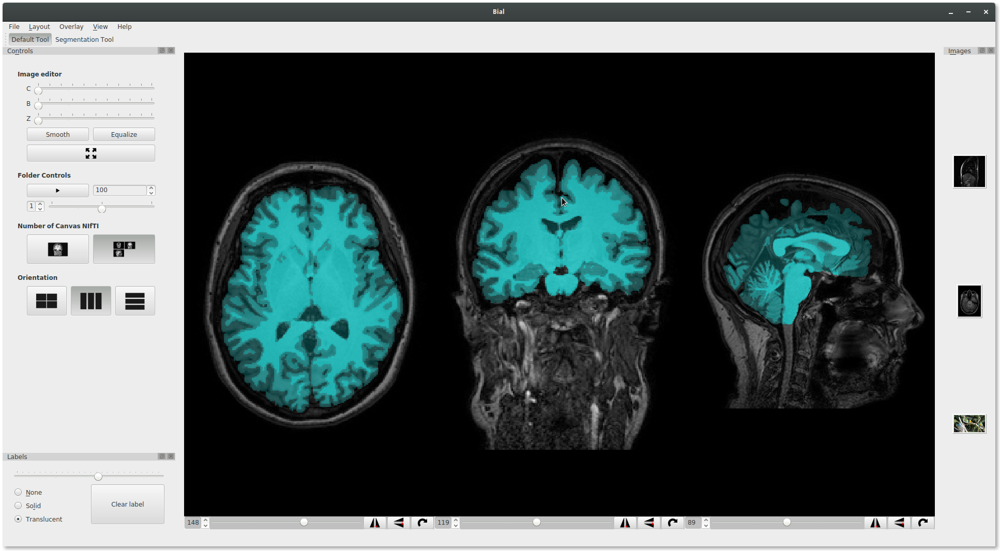

# Biomedical Image Analysis Library

The **Biomedical Image Analysis Library** is a poweful tool for developers, physicians, researchers, engineers, and so on.
With a intuitive user interface, a physician can make semi-automated diagnostics, segmentations, and apply sophisticated image processing filters using drag and drop features.

Since it is an **Open Source** Library, its tools and functions can be used by developers, researchers and engineers to make their own applications.

